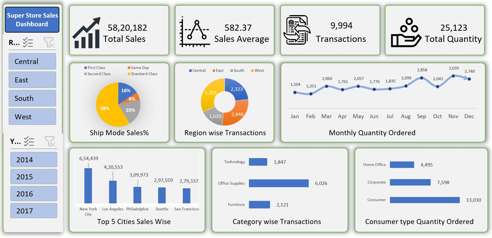

# 📊 Superstore Sales Analysis Dashboard | Excel

An interactive sales analysis dashboard developed in Microsoft Excel to transform Superstore sales data into meaningful business insights through KPIs, interactive filters, Pivot Tables, Pivot Charts, and data visualization.

---

## Project Overview

The **Superstore Sales Analysis Dashboard** is an Excel-based data analytics project created as part of my Data Analytics learning journey.

The purpose of this project is to analyze sales and transaction data across different regions, years, cities, product categories, customer segments, shipping modes, and months.

The dashboard provides an interactive interface that allows users to filter the data by **Region** and **Year** and dynamically explore key business metrics and trends.

---

## Dashboard Preview

---

## Business Objectives

The dashboard was designed to answer important business questions such as:

- What is the overall sales performance?
- How many transactions have been recorded?
- What is the average sales value?
- How many products have been ordered?
- Which regions generate the highest transaction volume?
- Which cities have the highest sales?
- Which product categories have the highest number of transactions?
- Which customer segment orders the highest quantity?
- Which shipping mode is most commonly used?
- How does order quantity change throughout the year?

---

## Key Performance Indicators

| KPI | Value |
|---|---:|
| Total Sales | 58,20,182 |
| Average Sales | 582.37 |
| Total Transactions | 9,994 |
| Total Quantity Ordered | 25,123 |

---

## Dashboard Components

### 1. Ship Mode Sales %

Analyzes the distribution of sales across different shipping modes:

- Standard Class
- Second Class
- First Class
- Same Day

The dashboard shows that **Standard Class accounts for the largest share of the displayed sales distribution at 58%**.

### 2. Region-wise Transactions

Compares transaction volumes across four regions:

- Central
- East
- South
- West

This provides a quick view of regional transaction performance.

### 3. Monthly Quantity Ordered

A monthly trend visualization showing how order quantity changes throughout the year.

It helps identify higher and lower order-volume periods.

### 4. Top 5 Cities by Sales

Highlights the five cities with the highest sales in the dataset.

The displayed analysis identifies:

1. New York City
2. Los Angeles
3. Philadelphia
4. Seattle
5. San Francisco

### 5. Category-wise Transactions

Analyzes transaction volume across the major product categories:

- Technology
- Office Supplies
- Furniture

Among the displayed categories, **Office Supplies has the highest transaction count**.

### 6. Customer Segment-wise Quantity Ordered

Compares quantity ordered across:

- Consumer
- Corporate
- Home Office

The **Consumer segment** has the highest quantity ordered among the displayed customer segments.

---

## Interactive Features

The dashboard includes interactive slicers that allow users to filter the analysis by:

- **Region**
- **Year**

The dashboard visuals and KPIs update based on the selected filters, making it easier to perform segmented analysis.

---

## Tools & Technologies

**Microsoft Excel**

Key Excel features used in this project:

- Pivot Tables
- Pivot Charts
- Slicers
- KPI Cards
- Data Aggregation
- Data Analysis
- Data Visualization
- Interactive Dashboard Design
- Chart Formatting
- Business Reporting

---

## Data Analysis Techniques

The project demonstrates the application of several fundamental data analytics techniques:

- Aggregation and summarization
- Comparative analysis
- Trend analysis
- Category analysis
- Regional analysis
- Customer segmentation
- Top-N analysis
- KPI reporting
- Interactive filtering

---

## Key Insights

Based on the dashboard:

- Total sales amount to **58,20,182**.
- The dashboard contains **9,994 transactions**.
- Total quantity ordered is **25,123**.
- **Standard Class** represents the largest share of the displayed shipping-mode sales distribution at **58%**.
- **New York City** is the highest-selling city among the displayed Top 5 cities.
- **Office Supplies** records the highest transaction volume among the displayed product categories.
- The **Consumer** segment has the highest quantity ordered among the three customer segments.
- Monthly quantity analysis shows noticeable variation in order volume throughout the year.

---

## Learning Outcomes

Through this project, I developed practical experience in:

- Working with structured sales data
- Creating business-oriented KPIs
- Building Pivot Table-based analysis
- Designing interactive Excel dashboards
- Creating meaningful data visualizations
- Using Slicers for interactive reporting
- Identifying trends and patterns
- Presenting analytical findings in a clear format

This project helped me understand how Excel can be used not only for calculations and spreadsheets, but also as a powerful tool for **business analysis and data-driven reporting**.

---

## Future Improvements

The dashboard can be further enhanced by adding:

- Profit and Profit Margin analysis
- Year-over-Year Sales Growth
- Sales vs. Profit analysis
- Category and Sub-Category performance
- Top and Bottom performing products
- Regional profitability analysis
- Monthly Sales and Profit trends
- Additional KPI metrics
- Power BI version of the dashboard

---

## Project Files

| File | Description |
|---|---|
| `Superstore_Sales_Dashboard.xlsx` | Excel workbook containing the interactive dashboard |
| `dashboard-preview.jpg` | Dashboard preview image |
| `README.md` | Project documentation |

---

## Project Status

**Completed**

This project was developed as part of my ongoing Data Analytics learning journey, with a focus on building practical projects and strengthening my Microsoft Excel skills.

---

## About the Author

### Pankaj Panchal

Aspiring Data Analyst with a background in **B.Sc.** and currently developing practical skills in **Data Analytics and Business Intelligence**.

Currently building hands-on projects and strengthening skills in:

- Microsoft Excel
- SQL
- Power BI
- Python
- Data Analysis
- Data Visualization

I am focused on continuously learning, building practical projects, and developing the skills required to solve real-world data problems.

---

## Connect With Me

**GitHub:** Pankaj Panchal  
**LinkedIn:** Pankaj Panchal

---

## Acknowledgement

This project was created as part of my Data Analytics learning journey with guidance and practical training from **Satish Dhawale at Skillcourse**.

---

## License

This project is intended for educational and portfolio purposes.
